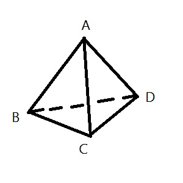

## Tetrahedron
### Description
An ant is crawling on the edges of a tetrahedron, initially at point A. Each second, it will move to the other 3 points with an equal possibility, which is $\frac{1}{3}$. What's the probabilty that the ant will be at point A after $t$ seconds?



### Input
There are multiple test cases, no more than $100$ cases.

For each case, the line contains a integer $t$.

TODO: EOF end

### Output
For each test case, output the answer rounded to six decimal places in a line.

### Constraints
$0\le t \le 10^{10^5}$

### Sample 1
#### Sameple Input
```
0
2
5
```

#### Sample Output
```
1.000000
0.333333
0.246914
```

## NOTE

题面已修改，数据范围改为了 $10^{18}$，并且取消了多组数据。